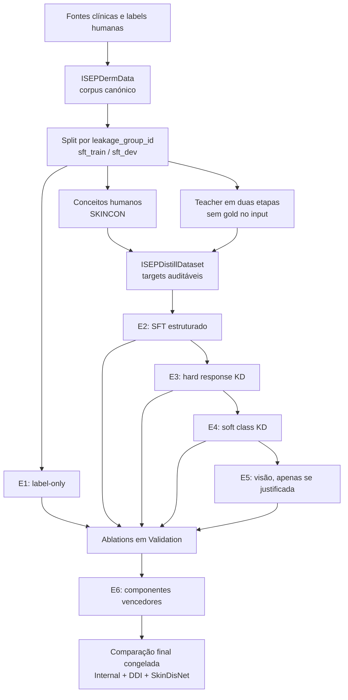

# ISEP — Small Multimodal Language Models for Dermatology

> Repositório de investigação para uma dissertação do ISEP sobre especialização e *knowledge distillation* de modelos multimodais pequenos em dermatologia.

Este projeto estuda se um modelo multimodal pequeno, especializado num domínio clínico fechado, consegue aproximar-se ou superar um modelo maior na mesma tarefa, usando menos memória, menor latência e menor custo de inferência. O caso de estudo é a classificação e descrição de imagens dermatológicas segundo uma taxonomia congelada de 21 doenças.

O repositório já contém a pipeline de dados, datasets privados versionados, benchmarks reproduzíveis, backends de inferência, resultados *baseline* e um piloto de atribuição visual. A construção do dataset de distilação e o treino do modelo pequeno estão especificados, mas ainda não estão concluídos.

> [!CAUTION]
> Este é software de investigação. Não é um dispositivo médico, não foi validado para uso clínico e não deve ser usado para diagnosticar, aconselhar ou tratar doentes.

## Visão geral

| Elemento | Decisão atual |
| --- | --- |
| Domínio | Dermatologia a partir de imagens clínicas |
| Pergunta central | Um MLLM pequeno e especializado pode atingir desempenho não inferior ao de um MLLM maior numa taxonomia dermatológica fechada? |
| *Student* oficial | [`Qwen/Qwen3.5-4B`](https://huggingface.co/Qwen/Qwen3.5-4B), aproximadamente 4,66B parâmetros |
| Comparador grande local | [`Qwen/Qwen3.6-27B`](https://huggingface.co/Qwen/Qwen3.6-27B), aproximadamente 27,78B parâmetros |
| *Teacher* de geração | Ainda por congelar; a escolha deve considerar qualidade, *teachability*, estabilidade, custo e não apenas Top-1 |
| Corpus canónico de treino | `ISEPDermData` v1.3.0: 7.541 imagens, 5.671 grupos *leakage-safe*, 21 classes |
| Dataset de especialização | `ISEPDistillDataset`, atualmente uma especificação anterior à implementação |
| Benchmark principal | `ISEPDermaBench` v1.9.0, privado, com referências isoladas dos pedidos enviados ao modelo |
| Comparação principal | `E0_base` → `E1_label` → `E2_structured` → `E3_hard_kd` → `E4_soft_kd` → extensões visuais justificadas → `E6_final` |
| Estado em 2026-08-11 | Dados e avaliação implementados; treino e dataset de distilação pendentes |

## 1. Pergunta de investigação

A formulação de trabalho da pergunta principal é:

> Um pequeno modelo multimodal especializado consegue atingir desempenho não inferior ao de um modelo multimodal grande numa taxonomia dermatológica fechada?

A tese não parte do pressuposto de que modelos pequenos são universalmente superiores a modelos grandes. A hipótese é mais restrita e testável:

> Sob os mesmos casos, prompts, métricas e protocolo de avaliação, um modelo de aproximadamente 4B parâmetros, especializado com dados dermatológicos de qualidade, pode fechar o *gap* para um modelo maior generalista e eventualmente ultrapassá-lo em algumas capacidades, mantendo uma vantagem clara de eficiência.

A margem de não inferioridade deve ser pré-registada antes da avaliação final. Uma margem de cinco pontos percentuais foi discutida como exemplo metodológico, mas não deve ser tratada como congelada sem uma estimativa de variância e uma decisão formal.

### Hipóteses experimentais

- **H1 — especialização diagnóstica:** o treino `image → gold label` melhora o Qwen 3.5 4B relativamente ao modelo base.
- **H2 — supervisão clínica estruturada:** conceitos visuais, descrições curtas, diferenciais e ligações explícitas à evidência melhoram diagnóstico e *grounding* para além de `label-only`.
- **H3 — *response distillation*:** respostas curtas e filtradas de um *teacher* acrescentam conhecimento transferível ao melhor modelo supervisionado.
- **H4 — *soft distillation*:** probabilidades do *teacher* sobre as 21 classes melhoram ranking ou calibração para além dos *hard targets*.
- **H5 — visão:** se persistir um erro visual mensurável, adaptação visual seletiva ou *feature distillation* pode acrescentar valor; essa complexidade não é assumida à partida.
- **H6 — eficiência:** o melhor *student* deve ser avaliado não só por qualidade clínica, mas também por VRAM, latência, *throughput*, tokens e custo.

### O que a tese pode e não pode demonstrar

A comparação pode sustentar que um SLM especializado é competitivo ou superior num domínio, taxonomia e protocolo concretos. Não sustenta uma conclusão universal de que “SLMs são melhores do que LLMs”, nem prova segurança clínica fora dos datasets avaliados.

Também não se pretende reconstruir o raciocínio privado de um dermatologista ou do *teacher*. O objeto mensurável é uma sequência observável: identificar evidência visível, produzir um diferencial verificável, expressar incerteza e decidir quando classificar, pedir informação ou abster.

## 2. Desenho experimental

O princípio central é introduzir uma alteração de cada vez. As primeiras experiências partem do mesmo checkpoint base, usam os mesmos splits e são avaliadas com o mesmo protocolo; só no final se combinam os componentes que demonstrarem valor isoladamente.



Este desenho separa quatro perguntas que seriam confundidas num único treino final:

1. quanto se ganha apenas com labels humanas;
2. quanto se ganha com supervisão clínica mais rica;
3. quanto do ganho adicional vem do *teacher*;
4. se o erro restante exige alterar a componente visual.

## 3. Ecossistema de dados

O projeto distingue rigorosamente dados de treino, supervisão auxiliar e avaliação.

### 3.1 `ISEPDermData`: corpus canónico

O repositório privado Hugging Face [`danielfdias98/ISEPDermData`](https://huggingface.co/datasets/danielfdias98/ISEPDermData) corresponde ao pool de imagens e labels a partir do qual será construído o treino. O nome correto é **ISEPDermData**, não `ISEPDermDataset`.

| Fonte | Imagens | Função no corpus |
| --- | ---: | --- |
| Fitzpatrick17k-C | 3.226 | Cobertura de doenças e análise por fototipo, usando a variante corrigida |
| HIBA | 318 | Diversidade geográfica e imagens clínicas hospitalares da Argentina |
| PAD-UFES-20 | 1.629 | Imagens de smartphone e diagnóstico com provenance clínica |
| SCIN | 2.368 | Condições comuns, aquisição real, múltiplas vistas e contexto autorreportado |
| **Total** | **7.541** | **21 classes e 5.671 grupos indivisíveis** |

A release atual tem apenas o split `train` porque ainda é um pool não dividido. Antes do treino será materializada uma separação `sft_train`/`sft_dev` por `leakage_group_id`, nunca por linha ou imagem isolada.

Existe ainda uma camada histórica em `data/training/dermatology_multimodal_v1` com um pool/queue de 81.787 linhas. Essa fila antecede o release canónico atual, cobre apenas 6.735 dos 7.541 `sample_id` atuais e não é o `ISEPDistillDataset`. Deve ser reconstruída a partir do `ISEPDermData` v1.3.0 antes de qualquer geração em escala.

O schema atual preserva:

```text
image
source
label
disease_id
sample_id
source_image_id
source_label
leakage_group_id
diagnosis_basis
image_sha256
license_id
```

Mais detalhes: [dataset card local](data/training/ISEPDermData/README.md).

### 3.2 Fontes auxiliares

| Fonte | Utilização prevista | Regra principal |
| --- | --- | --- |
| [SKINCON](configs/datasets/skincon/README.md) | 48 conceitos de morfologia anotados por especialistas | Prioridade sobre conceitos equivalentes gerados pelo *teacher*; DDI continua reservado à avaliação |
| [SkinCaRe / SkinCAP / SkinCoT](configs/datasets/skincare/README.md) | Captions e estrutura clínica auxiliar | Uso condicional a licença inequívoca, remoção de overlap e auditoria de *gold-conditioning* |
| [DDI](configs/datasets/ddi/README.md) | Generalização externa e conceitos SKINCON externos | Nunca usado para criar targets de treino |
| [SkinDisNet](configs/datasets/skindisnet/README.md) | Avaliação externa por doente | Imagens aumentadas não contam como casos independentes |
| [DermoBench](configs/datasets/dermobench/README.md) | Avaliação complementar em tarefas dermatológicas | Filtrado contra overlap de treino e reportado separadamente |

O aumento do número de imagens não é, por si só, uma justificação. Cada fonte tem de acrescentar uma função mensurável, conservar a sua provenance e respeitar os termos originais.

### 3.3 Regra de leakage

Uma amostra só pode entrar em `sft_train` ou `sft_dev` se o seu `leakage_group_id` não ocorrer em Validation, Internal Benchmark, DDI, SkinDisNet ou qualquer outro conjunto reservado. A regra inclui:

- cópias exatas;
- recompressões e redimensionamentos;
- duplicados percetuais revistos;
- várias fotografias do mesmo doente, caso ou lesão;
- crops ou derivados reconhecidos da mesma imagem.

Os splits usam grupos inteiros. Uma lesão com várias fotografias nunca pode contribuir simultaneamente para treino e avaliação.

## 4. `ISEPDistillDataset`: dataset de especialização planeado

O [`ISEPDistillDataset`](annotations/final_dataset/01_isep_distill_dataset_construction_plan.md) será uma camada derivada e versionada; não substitui o `ISEPDermData`. O primeiro guarda targets de treino e respetiva provenance, enquanto o segundo continua a ser a fonte canónica de imagens e labels.

### 4.1 Unidade lógica

Uma fotografia canónica é identificada por `sample_id`. Várias fotografias do mesmo caso partilham `case_id` e `leakage_group_id`. A mesma fotografia pode originar várias linhas porque cada linha ensina uma capacidade diferente, não porque se pretendam respostas arbitrárias para a mesma pergunta.

```text
canonical sample
  ├── diagnosis      imagem → label ou ranking
  ├── morphology     imagem → conceitos visíveis
  ├── caption        imagem → descrição clínica curta
  ├── structured     imagem → observações + diferencial + evidência + ação
  └── open_response  imagem → resposta clínica natural e curta
```

A primeira release deverá expor cinco configurações Hugging Face ligadas por `sample_id`:

| Configuração | Target | Fonte preferencial |
| --- | --- | --- |
| `diagnosis` | classe ou diferencial Top-K | gold normalizado; ranking auxiliar do *teacher* |
| `morphology` | conceitos e limitações observáveis | SKINCON, geração aceite e revisão humana |
| `caption` | descrição curta sem história inventada | SkinCAP elegível ou rendering da perceção aceite |
| `structured` | JSON com qualidade, observações, diferencial, evidência, incerteza e ação | duas etapas aceites do *teacher* |
| `open_response` | resposta clínica curta e natural | rendering consistente do mesmo target canónico |

`preferences` e *rollouts* on-policy só serão adicionados quando existir uma experiência DPO ou on-policy concreta.

### 4.2 JSON e resposta aberta

O JSON não é necessário porque o modelo “pense em JSON”. É usado porque permite validar cada campo, impor vocabulários, comparar outputs e detetar contradições. A resposta aberta continua a existir numa configuração própria para ensinar comunicação natural.

As duas representações derivam dos mesmos factos aceites:

```text
target canónico auditável
  ├── rendering estruturado em JSON
  └── rendering aberto, curto e natural
```

Uma resposta aberta não deve esconder factos que contradizem o JSON. A consistência entre ambos é um *quality gate*.

### 4.3 Geração do *teacher* em duas etapas

O *teacher* não recebe o `gold_diagnosis` na condição principal.

O modelo final de geração ainda não está formalmente selecionado. O Qwen 3.6 27B é um candidato local natural por pertencer à mesma família do *student*, mas deve competir com os restantes candidatos na Validation e, idealmente, pela aprendizagem que os seus targets produzem no 4B. Toda a release deve registar o modelo e a revisão efetivamente usados.

**Etapa A — perceção visual answer-blind**

- avalia qualidade e limitações da imagem;
- descreve apenas morfologia, cor, superfície, bordo, distribuição e localização visíveis;
- não apresenta um diagnóstico como se fosse uma observação;
- não inventa sintomas, duração, exames ou história clínica.

**Etapa B — diferencial e grounding**

- recebe novamente a imagem e a saída congelada da Etapa A;
- constrói um diferencial curto;
- liga cada hipótese a evidência favorável, evidência contrária e informação em falta;
- decide entre classificar, pedir contexto, pedir uma fotografia melhor, escalar ou abster.

Só depois destas duas chamadas o pipeline consulta a label gold para aceitar, rejeitar ou conservar parcialmente o target. Uma Etapa A visualmente válida pode ser usada mesmo quando o diagnóstico da Etapa B está errado.

### 4.4 Conteúdo que não pertence ao core

- *Chain-of-thought* privada ou extensa do *teacher*;
- logits do vocabulário completo em cada token;
- *hidden states* e features visuais volumosas;
- outputs brutos não validados como targets públicos;
- informação clínica ausente da imagem ou da metadata real.

Outputs brutos podem ser preservados num *audit store* privado. Se existir soft KD, serão guardadas preferencialmente probabilidades das labels canónicas (`class_logprobs`) em *sidecars* versionados, não numa coluna gigante do dataset clínico.

### 4.5 Fases de construção

| Fase | Trabalho | Critério de saída |
| ---: | --- | --- |
| 0 | Congelar taxonomy, inputs, exclusões, licenças, schemas, prompts e splits | contratos versionados e sem overlap conhecido |
| 1 | Integrar supervisão humana elegível | joins SKINCON/SkinCAP auditados e conflitos explícitos |
| 2 | Piloto estratificado de 100 casos | comparação de protocolos, custo, truncamentos, erros e acceptance rate |
| 3 | Gerar Etapa A | perceção answer-blind parseável e visualmente suportada |
| 4 | Gerar Etapa B | diferencial, evidence links e ação válidos |
| 5 | Comparar com gold e aplicar gates | aceitação total, parcial ou rejeição reproduzível |
| 6 | Renderizar as configurações de treino | linhas curtas por capacidade, ligadas por IDs estáveis |
| 7 | Revisão humana e freeze | dataset card, hashes, contagens, prompts e relatório de qualidade |

### 4.6 Quality gates

Toda a linha candidata passa, no mínimo, por:

1. licença e provenance;
2. integridade do asset e ausência de leakage;
3. JSON Schema, enums e vocabulários controlados;
4. ligação de afirmações à evidência visível;
5. dependência real da imagem;
6. consistência clínica e comparação pós-geração com gold;
7. consistência entre JSON e resposta aberta;
8. cobertura por classe, fonte, dificuldade e subgrupo.

Se os filtros aceitarem apenas casos fáceis, a solução não é baixar silenciosamente o limiar. É rever amostragem, prompt, *teacher* ou cobertura humana e publicar o padrão de rejeição.

## 5. Fases de treino

`Label-only` e distilação são experiências diferentes e devem permanecer separadas. Treinar com a label gold é supervisão convencional; só existe distilação quando o *student* aprende um sinal produzido ou exposto pelo *teacher*.

| Experiência | Dados/objetivo | Pergunta respondida |
| --- | --- | --- |
| `E0_base` | Qwen 3.5 4B original, sem treino | Qual é o ponto de partida? |
| `E0_vision` | Classificador visual ou *linear probe*, se viável | A geração multimodal acrescenta algo à classificação pura? |
| `E1_label` | imagem → diagnóstico gold | Quanto se ganha apenas com labels? |
| `E2_structured` | `E1` + qualidade, conceitos, descrição, diferencial e grounding | Supervisão clínica estruturada acrescenta valor? |
| `E3_hard_kd` | melhor `E2` + respostas filtradas do *teacher* | O conteúdo textual do *teacher* é transferível? |
| `E4_soft_kd` | `E3` + probabilidades sobre as classes canónicas | A distribuição do *teacher* melhora ranking/calibração? |
| `E5_vision` | melhor condição anterior + uma intervenção visual | Existe um bottleneck visual residual? |
| `E6_final` | apenas componentes vencedores | Qual é o melhor sistema final sob o mesmo protocolo? |

Para inferência causal limpa, `E1`, `E2`, `E3` e `E4` devem ser comparados como braços controlados a partir do mesmo modelo base sempre que possível. Um currículo sequencial pode ser usado para o modelo final, mas não substitui as ablações independentes.

### 5.1 `E1_label`: baseline obrigatório

Esta é a primeira fase de fine-tuning e a mais importante para interpretar todas as restantes. Se `label-only` já fechar grande parte do *gap*, a tese não pode atribuir esse ganho à distilação ou ao *multi-step reasoning*.

O target pode ser uma label canónica ou uma resposta mínima determinística. Não são necessários conceitos sintéticos, rationale, logits ou alterações visuais nesta fase.

### 5.2 `E2_structured`: supervisão clínica

O conteúdo deve ser adicionado incrementalmente quando o budget permitir:

```text
D0 label
  → D1 conceitos e qualidade
  → D2 diferencial e evidence links
  → D3 resposta aberta curta
  → D4 decisão adaptativa/abstenção
```

O target principal não é uma CoT longa. É uma rationale clínica curta, verificável e ligada a observações explícitas.

### 5.3 `E3_hard_kd`: *response distillation*

O *student* aprende os outputs aceites do *teacher*: observações, descrições, diferenciais, evidência contrária e ação. O raw reasoning interno não é necessário para classificar esta fase como distilação.

### 5.4 `E4_soft_kd`: distribuição de classes

A primeira experiência soft deve usar scores sobre as 21 labels completas. Como o nome de uma doença pode ocupar vários tokens, cada score deve representar a probabilidade condicional da label completa sob o mesmo prompt e template.

Top-K logits token-level, perdas de entropia adaptativas e on-policy KD são extensões posteriores. KD simples pode degradar um modelo quando o *teacher* erra ou o sinal está fora da capacidade do *student*, pelo que são necessários gates de confiança e ablações.

### 5.5 Ferramenta de treino: Unsloth

O extra `training` já declara `unsloth>=2026.7.3`. A estratégia prevista é:

- usar Unsloth com LoRA em BF16 para `E1`, `E2` e `E3`;
- começar com o encoder visual congelado e adaptar primeiro os componentes de linguagem/alinhamento suportados;
- evitar QLoRA 4-bit como baseline inicial do Qwen 3.5;
- implementar uma loss personalizada para `E4_soft_kd`;
- tratar `E5_vision` e feature KD como código experimental separado;
- guardar adapters em formato PEFT e congelar versões de Unsloth, Transformers, template e processor.

Unsloth é um backend de otimização, não uma variável científica. A experiência deve ser reproduzível fora das otimizações específicas sempre que possível. O ambiente de treino é separado do ambiente vLLM porque os extras `training` e `gpu` têm dependências incompatíveis.

> [!IMPORTANT]
> O repositório ainda não contém um trainer executável para estas fases. O extra de dependências e o plano metodológico existem; o treino permanece trabalho futuro.

## 6. Estratégia visual

Não será feita uma alteração arquitetural complexa no primeiro baseline. A ordem de risco crescente é:

| Braço | Intervenção | Decisão |
| --- | --- | --- |
| `V0` | modelo sem alteração | baseline |
| `V1` | SFT de morfologia e descrição | primeira intervenção visual |
| `V2` | projector ou LoRA nos últimos blocos visuais | apenas se `V1` deixar erro visual |
| `V3` | resolução, duas vistas ou multi-scale com compute controlado | ablation de detalhe/localização |
| `V4` | feature KD de um teacher visual | experiência avançada |
| `V5` | mecanismo inspirado em `FDLinear`/SkinFlow | piloto de último nível, não baseline |

O resultado relevante de SkinFlow é que o alinhamento por descrição deve ser testado antes de uma alteração arquitetural difícil de reproduzir. O projeto não assume que substituir a torre visual do Qwen 4B pela do 27B seja plug-and-play.

Cropping automático não é requisito do plano principal. Se for retomado, deve ser uma ablation pequena e emparelhada (`full image`, `crop`, `full + crop`) com crops revistos e sem usar o diagnóstico gold no localizador.

### Atribuição visual

O módulo [`src/vision_analysis`](src/vision_analysis/README.md) implementa um piloto separado de atribuição por oclusão. O piloto congelado contém três casos no checkpoint `E0_base` e mostra quais regiões alteram o score teacher-forced de um diagnóstico específico.

Este mapa não é uma segmentação nem acesso ao reasoning interno. A comparação útil será *before/after* com exatamente os mesmos casos, pixels, prompts, targets e parâmetros em `E0_base`, `E1_label`, `E2_structured`, `E3_hard_kd` e no modelo final. O estado e as limitações do piloto estão documentados em [atribuição visual, localização e accuracy](annotations/notes/17_visual_attribution_localization_vs_diagnostic_accuracy.md).

## 7. Avaliação

### 7.1 `ISEPDermaBench`

O dataset privado [`danielfdias98/ISEPDermaBench`](https://huggingface.co/datasets/danielfdias98/ISEPDermaBench) mantém os pedidos enviados ao modelo separados das referências usadas pelo scorer. As configurações `_references` nunca entram no prompt.

| Protocolo | Função principal | Splits relevantes |
| --- | --- | --- |
| `visual_top_k` | ranking de seis candidatos na taxonomia de 21 classes | Validation, Internal, DDI, SkinDisNet |
| `visual_confusion_sets` | comparação emparelhada de candidatos pouco/muito confundíveis | Validation, Internal |
| `evidence_grounded_diagnosis` | morfologia, descrição, diagnóstico e evidence links | Validation, Internal, DDI |
| `open_ended_diagnosis` | Top-3 livre e rationale visual, avaliada por juiz cego | Validation, Internal |
| `clinical_context_ablation` | mesma imagem com/sem contexto SCIN real | Validation, Internal |
| `visual_grounding_no_image` | comportamento quando não existe evidência visual | Validation |
| auditorias de alucinação | premissas falsas, imagem corrompida e hard-negative swaps | Validation |

Contagens, schemas e protocolo completo: [dataset card do ISEPDermaBench](data/benchmarks/ISEPDermaBench/README.md).

### 7.2 Porque existe o controlo sem imagem

O controlo não mede diagnóstico. Substitui a fotografia por uma imagem uniforme cinzenta, com as mesmas dimensões, para perguntar se o modelo reconhece que não pode observar uma lesão.

Um modelo que continua a descrever bordos, cor ou escamas nesta condição está a produzir afirmações a partir de priors textuais ou do prompt, não da imagem. O comportamento correto é `not_evaluable`/abstenção, baixa confiança e ausência de achados visuais.

### 7.3 Política de splits

```text
sft_train  → gradientes
sft_dev    → early stopping e seleção de checkpoint
Validation → prompts, teacher, thresholds, hiperparâmetros e ablações
Internal   → comparação final congelada
DDI/SkinDisNet → generalização externa; nunca tuning
```

O Internal Benchmark já foi executado para estabelecer o baseline pré-treino. Por esse motivo, os seus resultados estão documentados e o conjunto deve permanecer congelado a partir de agora; nenhuma decisão de treino deve ser otimizada sobre os seus casos.

### 7.4 Métricas

**Diagnóstico**

- Top-1, Top-3, Top-6, MRR e macro-F1;
- matriz de confusão e desempenho por classe;
- cobertura/accuracy sob abstenção;
- avaliação open-ended por juiz cego congelado.

**Perceção e grounding**

- F1 de conceitos SKINCON;
- precision/recall de achados visuais;
- validade dos evidence links;
- unsupported-finding rate;
- diferença entre imagem real, ausente, degradada ou trocada.

**Calibração, segurança e generalização**

- ECE/Brier e curvas risco-cobertura quando aplicável;
- pedidos de contexto, nova imagem, escalamento e abstenção;
- source, classe, modalidade e skin tone com suporte amostral explícito;
- DDI e SkinDisNet como avaliação externa.

**Eficiência**

- parâmetros treináveis e totais;
- VRAM, latência, throughput e energia quando mensurável;
- tokens e custo por caso;
- tempo e custo da geração/revisão do dataset.

### 7.5 Baseline pré-treino já medido

Qwen 3.5 4B e Qwen 3.6 27B completaram os mesmos 2.262 casos do Internal Benchmark com thinking desligado. Alguns resultados principais são:

| Métrica | Qwen 3.5 4B | Qwen 3.6 27B |
| --- | ---: | ---: |
| Visual Top-K Top-1 | 33,00% | **42,90%** |
| Visual Top-K Top-3 | 62,50% | **74,30%** |
| Confusion Sets Top-1 | 68,84% | **76,21%** |
| Evidence Top-1 | 41,79% | **46,27%** |
| Open-ended Top-1, juiz | 16,78% | **24,21%** |
| Open-ended Top-3, juiz | 38,11% | **51,23%** |

O 27B é mais forte no ranking diagnóstico zero-shot, mas ambos apresentam fragilidades de evidence grounding. O 4B obteve uma exceção no indicador conjuntivo `grounded_top_1_success`; isso não demonstra melhor raciocínio clínico e exige análise por caso. Estes valores são baseline, não o resultado da tese.

O estudo completo inclui ainda Qwen 3.8 Max, MiniMax M3, MiMo V2.5 e Gemini 3.5 Flash-Lite, bem como cobertura do juiz, failures e custos: [Internal Benchmark completo](annotations/benchmarks/10_internal_benchmark_qwen_3_5_vs_qwen_3_6.md).

## 8. Estado do projeto

| Componente | Estado | Evidência no repositório |
| --- | --- | --- |
| Normalização multi-source | Implementada | [`src/data_pipeline`](src/data_pipeline) |
| Deduplicação e grupos de leakage | Implementados | [análise de duplicados](annotations/dataset_pipeline/08_exact_and_perceptual_duplicate_analysis.md) e código de deduplicação |
| ISEPDermData v1.3.0 | Gerado e privado no Hub | [dataset card](data/training/ISEPDermData/README.md) |
| ISEPDermaBench v1.9.0 | Gerado, versionado e privado no Hub | [dataset card](data/benchmarks/ISEPDermaBench/README.md) |
| DermoBench filtrado | Materializado com 13 protocolos e overlap de treino removido | [dataset card](data/benchmarks/DermoBench/README.md) |
| Pipeline de benchmark | Implementada e testada | [`src/benchmark`](src/benchmark/README.md) |
| Backends locais/API | Implementados | [`src/inference`](src/inference/README.md) |
| Baselines pré-treino | Executados e documentados | [`annotations/benchmarks`](annotations/benchmarks) |
| Atribuição visual | Piloto qualitativo de três casos concluído | [`src/vision_analysis`](src/vision_analysis/README.md) |
| ISEPDistillDataset | Especificação metodológica | [plano detalhado](annotations/final_dataset/01_isep_distill_dataset_construction_plan.md) |
| Trainer `E1_label` | Implementado e testado; treino confirmatório pendente | [`src/train`](src/train/README.md) |
| Checkpoints privados | Repositório criado; upload automático por época | [`danielfdias98/ISEP-training-checkpoints`](https://huggingface.co/danielfdias98/ISEP-training-checkpoints) |
| Avaliação pós-treino | Pendente | depende do freeze do dataset e checkpoints |

## 9. Estrutura do repositório

```text
ISEP/
├── annotations/           decisões, resultados, limitações e notas para a dissertação
│   ├── dataset_pipeline/  construção, deduplicação e releases
│   ├── benchmarks/        protocolos e resultados experimentais
│   ├── final_dataset/     especificação do ISEPDistillDataset
│   └── notes/             decisões metodológicas e investigação
├── configs/
│   ├── datasets/          acesso, schema e mapeamento das fontes
│   ├── experiments/       experiências congeladas
│   ├── models/            modelos, backends e parâmetros de geração
│   ├── taxonomies/        taxonomia de doenças e confusion sets
│   └── vision_analysis/   casos congelados para atribuição visual
├── data/
│   ├── benchmarks/        mirrors locais das releases de avaliação
│   ├── manifests/         dados normalizados e auditáveis
│   ├── reports/           relatórios de cobertura/qualidade
│   └── training/          releases privadas de treino
├── doc/                   materiais da dissertação
├── outputs/               resultados reproduzíveis, geralmente ignorados por Git
├── scripts/               controladores e experiências específicas
├── src/
│   ├── benchmark/         execução, parsing, métricas, resume e relatórios HTML
│   ├── config/            validação tipada de YAML
│   ├── data_pipeline/     builders e validação de datasets
│   ├── inference/         vLLM, OpenAI-compatible, Azure e Transformers
│   ├── modal/             entrypoints de execução remota
│   └── vision_analysis/   atribuição visual por oclusão
└── tests/                 testes unitários da pipeline
```

O índice das decisões de desenvolvimento está em [`annotations/README.md`](annotations/README.md).

## 10. Instalação e utilização

### Requisitos

- Python 3.12 ou superior;
- [`uv`](https://docs.astral.sh/uv/);
- acesso aos datasets privados/restritos quando não se usa apenas o mirror local;
- Linux x86-64, CUDA e GPU NVIDIA para vLLM local;
- um ambiente GPU separado para fine-tuning com Unsloth.

### Ambiente base

```bash
uv sync
```

Este ambiente permite validar dados/configurações, executar *dry runs* e correr os testes em macOS sem descarregar pesos de modelos.

### Descobrir modelos e benchmarks

```bash
uv run python -m src.benchmark.cli list-models
uv run python -m src.benchmark.cli list-benchmarks
```

### Validar uma execução sem inferência

```bash
uv run python -m src.benchmark.cli run \
  --model qwen_3_5_4b \
  --benchmark visual_top_k_closed_set \
  --limit 10 \
  --dry-run
```

O *dry run* valida configs, seleção, imagens, prompts, schemas, isolamento das referências e identidade do run. Não carrega pesos, não inicia vLLM e não chama APIs quando o mirror local está disponível.

### Validar os dados existentes

```bash
uv run python -m src.data_pipeline.training_corpus --validate-only
uv run python -m src.data_pipeline.huggingface_dataset_export --validate-only
uv run python -m src.data_pipeline.huggingface_benchmark_export --validate-only
uv run python -m src.data_pipeline.dermobench_evaluation --validate-only
```

O comando legacy `src.data_pipeline.pipeline --validate-only` não é recomendado neste checkout: depende da árvore antiga `configs/benchmarks/derma_isep`/`data/benchmarks/derma_isep`, que já não está presente. Os comandos acima validam os artefactos materializados que o projeto usa atualmente.

### Validar o piloto visual

```bash
uv run python -m src.vision_analysis.cli --validate-only
```

### Testes

```bash
uv run python -m unittest discover -s tests
```

Os testes usam clientes injetados ou *dry runs* e não devem fazer download de pesos nem chamadas externas.

Na verificação de 2026-08-11, **206 testes passaram e 1 foi ignorado** por depender de um artefacto legacy ausente.

### Ambientes GPU

Benchmark local com vLLM:

```bash
uv sync --extra gpu
```

Fine-tuning com Unsloth:

```bash
uv sync --extra training
```

Os extras `gpu` e `training` são intencionalmente incompatíveis e devem ser instalados em ambientes virtuais separados. Consulte o [guia completo da pipeline de benchmark](src/benchmark/README.md) e o [guia de inferência](src/inference/README.md).

### Hugging Face privado

```bash
hf auth login
hf auth whoami
```

Exemplo de leitura das tarefas e referências em separado:

```python
from datasets import load_dataset

tasks = load_dataset(
    "danielfdias98/ISEPDermaBench",
    "visual_top_k",
    split="validation",
)
references = load_dataset(
    "danielfdias98/ISEPDermaBench",
    "visual_top_k_references",
    split="validation",
)
```

As duas tabelas só são unidas por `task_id` dentro do scorer.

Este exemplo requer o package Python `datasets`, que não pertence atualmente às dependências base do `pyproject.toml`.

## 11. Reprodutibilidade

Cada dataset, run e checkpoint deve congelar:

- revisão dos datasets, imagens e modelos;
- taxonomy e mappings;
- grupos excluídos e respetivo hash;
- prompt, chat template, processor e JSON Schema;
- parâmetros de geração e versão do backend;
- seed, algoritmo de split e hiperparâmetros;
- decisões dos quality gates e contagens antes/depois;
- outputs brutos, parsed outputs, erros e truncamentos;
- hashes dos Parquets, adapters e checkpoints;
- latência, tokens, custo e hardware.

As configurações locais dos Qwen apontam atualmente para `revision: main`; os resultados finais devem usar hashes de commit imutáveis para modelo e processor.

Os resultados inválidos permanecem no denominador. O parser pode recuperar uma escolha clínica para análise, mas essa recuperação não apaga a falha de formato original.

## 12. Evidência científica que orienta o plano

O plano completo, com limitações e bibliografia, encontra-se em [construção do ISEPDistillDataset](annotations/final_dataset/01_isep_distill_dataset_construction_plan.md). Os trabalhos mais diretamente ligados às decisões são:

| Trabalho | Decisão que informa |
| --- | --- |
| [SKINCON, NeurIPS Datasets and Benchmarks 2022](https://papers.nips.cc/paper_files/paper/2022/hash/7318b51b52078e3af28197e725f5068a-Abstract-Datasets_and_Benchmarks.html) | usar conceitos humanos de morfologia para supervisão e debugging |
| [SkinGPT-4, Nature Communications 2024](https://doi.org/10.1038/s41467-024-50043-3) | separar alinhamento imagem-conceito de interação clínica posterior |
| [PanDerm, Nature Medicine 2025](https://doi.org/10.1038/s41591-025-03747-y) | considerar um teacher visual de domínio se a visão continuar a ser o bottleneck |
| [MAKE, MICCAI 2025](https://arxiv.org/abs/2505.09372) | preferir targets curtos por aspeto clínico a uma caption monolítica |
| [LLaVA-KD, ICCV 2025](https://openaccess.thecvf.com/content/ICCV2025/html/Cai_LLaVA-KD_A_Framework_of_Distilling_Multimodal_Large_Language_Models_ICCV_2025_paper.html) | separar SFT e transferência multimodal/relacional em fases |
| [DermoGPT, arXiv 2026](https://arxiv.org/abs/2601.01868) | medir morfologia e diagnóstico como capacidades distintas; começar por SFT |
| [SkinFlow, arXiv 2026](https://arxiv.org/abs/2601.09136) | testar descrição visual antes de uma alteração arquitetural experimental |
| [UniCon, ACM MM 2026](https://arxiv.org/abs/2608.03225) | usar conceitos multifacetados e gates de fiabilidade em supervisão conceptual |
| [LaViD, arXiv 2026](https://arxiv.org/abs/2606.27527) | explorar assinaturas conceptuais por classe como auxiliar de baixo custo |
| [CORAL, arXiv 2026](https://arxiv.org/abs/2607.03647) | considerar hard negatives visualmente semelhantes para medir dependência da imagem |
| [Distillation Traps and Guards, ACL 2026](https://aclanthology.org/2026.acl-long.908/) | filtrar erros do teacher, ruído de cauda e sinais incompatíveis com o student |

Esta literatura motiva experiências; não demonstra antecipadamente que a combinação exata Qwen 3.6 27B → Qwen 3.5 4B funcionará nos dados do ISEP.

## 13. Ética, licenças e segurança

- As imagens podem ser sensíveis ou gráficas e devem permanecer em armazenamento com acesso controlado.
- Cada linha conserva `source` e `license_id`; não existe uma licença única que substitua os termos upstream.
- DDI está sujeito ao respetivo Research Use Agreement.
- SkinCaRe e alguns derivados têm restrições adicionais e permanecem condicionais.
- Não se deve publicar ou redistribuir imagens, captions, outputs derivados ou checkpoints sem rever os termos aplicáveis.
- Labels têm níveis diferentes de certeza diagnóstica; isso deve ser preservado e reportado.
- Outputs sintéticos são supervisão gerada e filtrada, não pareceres médicos.
- Análises por skin tone, sexo/género, idade ou origem precisam de tamanho amostral, missingness e potenciais confundidores explícitos.
- O repositório ainda não declara uma licença global para o código; a ausência de uma licença não concede direitos de reutilização.

## 14. Próximas entregas

1. materializar `sft_train` e `sft_dev` por `leakage_group_id`;
2. implementar schemas, enums e builder canónico do `ISEPDistillDataset`;
3. reproduzir e congelar os joins SKINCON elegíveis;
4. executar o piloto do *teacher* em 100 casos e escolher o protocolo de geração;
5. publicar um preview privado das cinco configurações no Dataset Viewer;
6. implementar o collator multimodal e o smoke test de overfit;
7. treinar e avaliar `E1_label`;
8. acrescentar incrementalmente `E2_structured` e `E3_hard_kd`;
9. testar `E4_soft_kd` apenas com um baseline estável;
10. avançar para `E5_vision` apenas perante um erro visual residual mensurável;
11. congelar `E6_final` e executar a comparação pós-treino sem tuning sobre Internal/DDI/SkinDisNet.

## 15. Documentação principal

- [Índice de todas as anotações](annotations/README.md)
- [Plano detalhado do ISEPDistillDataset](annotations/final_dataset/01_isep_distill_dataset_construction_plan.md)
- [Fluxo atual entre Validation, Internal Benchmark e fine-tuning](annotations/notes/06_fluxo_validation_internal_benchmark_e_fine_tuning.md)
- [Seleção de teacher/student e processo final](annotations/benchmarks/05_teacher_student_selection_and_final_benchmark_process.md)
- [Estratégia de reasoning visual](annotations/notes/11_dermatology_mllm_reasoning_strategy_research.md)
- [Reasoning, visão e controlo sem imagem](annotations/notes/15_reasoning_vision_and_no_image_grounding_ablation.md)
- [SkinFlow e estratégia do encoder visual](annotations/notes/16_skinflow_architecture_and_visual_encoder_strategy.md)
- [Pipeline de benchmark](src/benchmark/README.md)
- [Dataset configurations](configs/datasets/README.md)
- [ISEPDermaBench](data/benchmarks/ISEPDermaBench/README.md)
- [ISEPDermData](data/training/ISEPDermData/README.md)

---

Este README descreve o plano e o estado do projeto em **11 de agosto de 2026**. As decisões científicas continuam sujeitas às ablações, aos quality gates e à revisão humana documentados no repositório.
