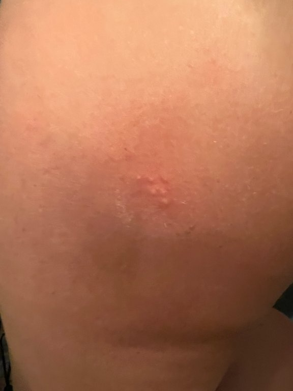
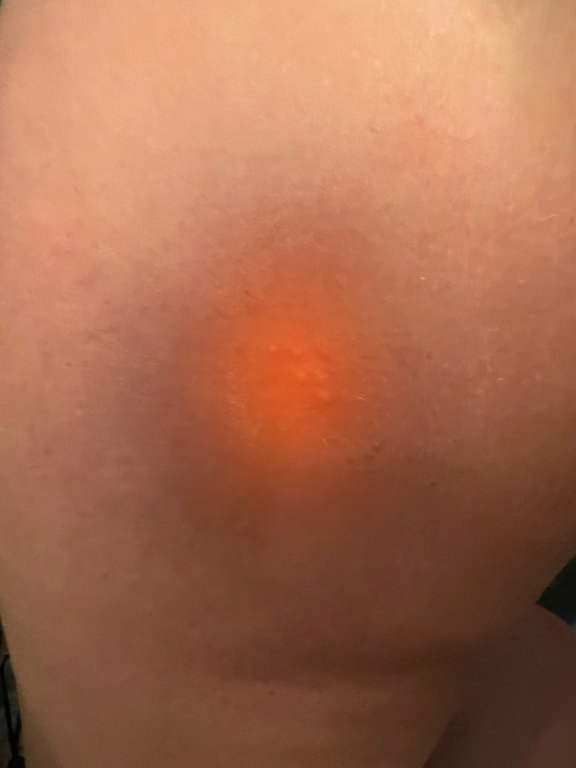
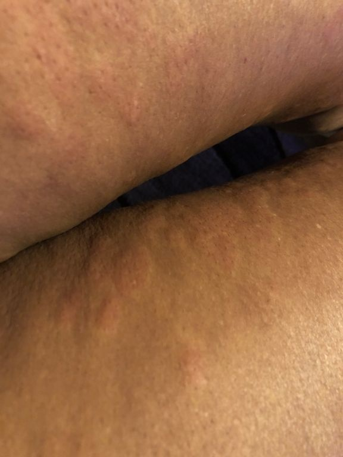
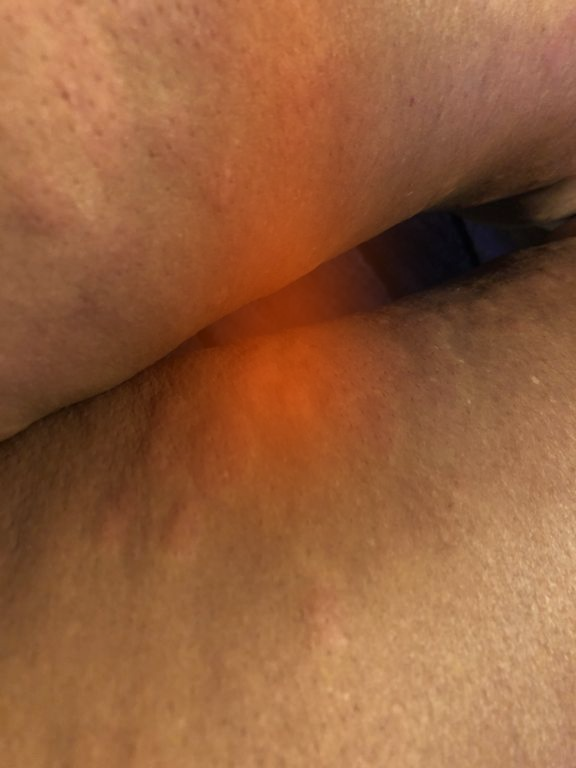
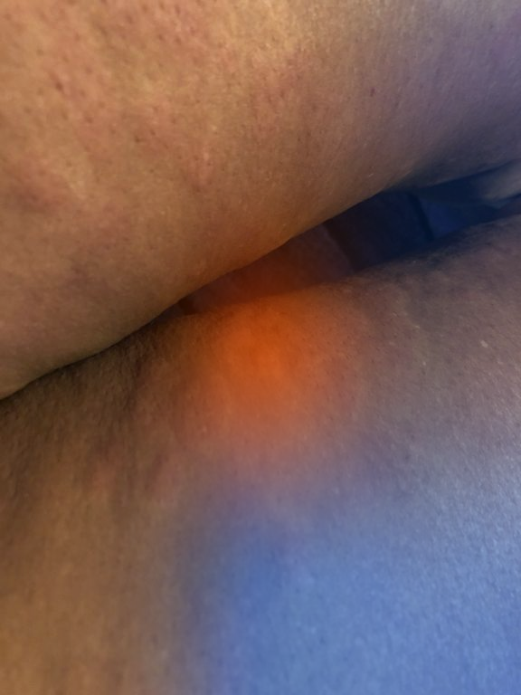
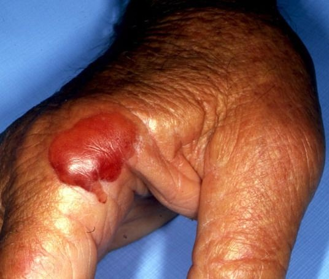
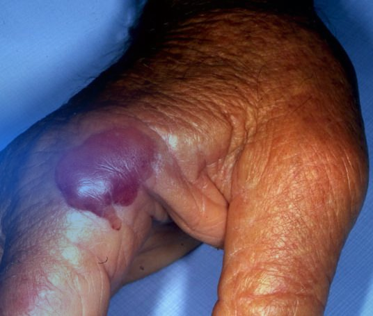
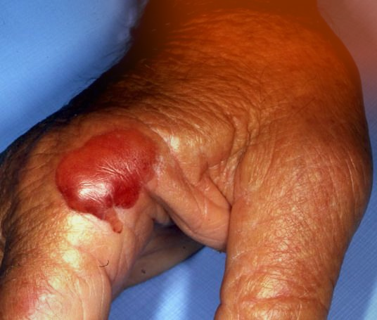

# Atribuição visual, localização e accuracy diagnóstica

**Data:** 2026-08-11  
**Estado:** piloto qualitativo frozen de três casos concluído; comparação pré/pós fine-tuning ainda pendente  
**Âmbito:** Qwen/Qwen3.5-4B, checkpoint base `E0_base`, atribuição por oclusão de patches

## Pergunta

Como pode o modelo destacar corretamente a região da lesão numa imagem e, ao
mesmo tempo, apresentar uma accuracy diagnóstica global inferior noutra
avaliação ou condição experimental?

## Resposta curta

Não existe contradição. A visualização responde a uma pergunta local e
condicional — “que região altera o score deste diagnóstico específico nesta
imagem?” — enquanto a accuracy responde a uma pergunta global e competitiva —
“em quantos casos o diagnóstico correto obteve o maior score entre todas as
classes?”. Localizar a lesão é importante, mas não é suficiente para distinguir
a morfologia, mapear essa morfologia para a taxonomia correta e superar todos os
diagnósticos concorrentes.

O primeiro caso foi congelado antes de observar o mapa como pertencendo à
coorte `correct_top1`, e tanto o gold label como a previsão de benchmark eram
`D011: Acne vulgaris`. O run completo adicionou dois casos de erro também
pré-declarados: um em que o gold label permaneceu no Top-6 e outro em que ficou
fora do Top-6. Esta seleção evita escolher exemplos apenas porque os mapas
parecem convincentes.

Há ainda uma distinção factual importante. O relatório analisado contém apenas
o checkpoint base `E0_base`. O capítulo experimental indica que as avaliações
completas dos checkpoints label-only e posteriores continuam pendentes. Logo,
este artefacto **não mede uma diminuição pré/pós fine-tuning**. Se “diminuição da
accuracy” se referir a valores observados entre benchmarks, modelos, prompts ou
backends diferentes, essas diferenças também não podem ser atribuídas a esta
imagem sem uma comparação emparelhada e controlada.

## Evidência local do caso de controlo

| Campo | Valor |
|---|---|
| Run | `qwen_3_5_4b_e0_visual_attribution_pilot_v1` |
| Modelo | `Qwen/Qwen3.5-4B` |
| Revisão | `851bf6e806efd8d0a36b00ddf55e13ccb7b8cd0a` |
| Execução | MPS, `float16` |
| Caso | `SCIN_966663640331506400_IMAGE_2` |
| Coorte pré-declarada | `correct_top1` |
| Gold / previsão | `D011: Acne vulgaris` / `D011: Acne vulgaris` |
| Método | oclusão por patch desfocado, grelha 3 × 3 |
| Score | log-probabilidade média teacher-forced dos tokens do diagnóstico-alvo |
| Score original | `-0.348405` |
| Score com patch central ocultado | `-1.047143` |
| Queda de score no centro | `+0.698738` |

| Imagem usada pelo relatório | Overlay de atribuição para `D011` |
|---|---|
|  |  |

**Legenda proposta.** Exemplo exploratório de atribuição visual no checkpoint
base Qwen3.5-4B. A grelha 3 × 3 foi perturbada desfocando um patch de cada vez.
A região vermelha central indica que ocultar essa região reduziu fortemente o
score teacher-forced de `D011: Acne vulgaris`. O resultado é consistente com
dependência do modelo em evidência situada na lesão, mas não constitui uma
segmentação, uma explicação causal completa, nem evidência de melhoria da
accuracy global.

A matriz de quedas de score, antes da normalização visual, foi:

```text
[[-0.081460, -0.107319,  0.020265],
 [-0.083531,  0.698738, -0.021294],
 [-0.083440, -0.112447, -0.104757]]
```

Seja `s(y, x)` o score do diagnóstico-alvo `y` na imagem `x` e `x_i` a imagem
com o patch `i` desfocado. O mapa usa:

```text
delta_i(y) = s(y, x) - s(y, x_i)
```

Um `delta_i(y)` positivo significa que o patch apoia **esse alvo**. A decisão de
classificação, porém, depende de:

```text
predicao(x) = argmax_c s(c, x)
```

Por isso, `delta_i(D011) > 0` na lesão não implica que `D011` venceria qualquer
classe concorrente em qualquer imagem. O diagnóstico errado também pode ter um
mapa centrado na lesão.

## Run completo dos três casos congelados

O comando confirmado foi executado em 2026-08-11:

```bash
uv run python -m src.vision_analysis.cli \
  --device mps \
  --dtype float16 \
  --output outputs/vision_analysis/qwen_3_5_4b_e0_visual_attribution_pilot_v1/all_frozen_cases
```

A execução terminou com `exit code 0`, durou aproximadamente 6 minutos e 30
segundos e produziu 23 ficheiros, com 2.6 MB no total. O aviso de fallback para
a implementação PyTorch era esperado; não ocorreu crash, timeout ou retry. O
manifesto final tem `status: complete` e contém exatamente os três casos
pré-declarados.

### Resultados descritivos

| Coorte | Gold / previsão do benchmark | Score original gold / previsão | Maior queda gold / previsão | Tile máximo gold / previsão | Similaridade dos mapas |
|---|---|---:|---:|---|---:|
| `correct_top1` | Acne vulgaris / Acne vulgaris | `-0.348 / -0.348` | `0.699 / 0.699` | centro / centro | `rho=1.000` |
| `wrong_gold_in_top6` | Urticaria / Psoriasis | `-0.736 / -0.982` | `0.583 / 0.100` | centro / centro | `rho=0.633` |
| `wrong_gold_absent_top6` | Drug eruption / Squamous cell carcinoma | `-0.983 / -0.517` | `0.059 / 0.179` | superior-centro / superior-direita | `rho=0.533` |

As correlações de Spearman são descrições de apenas nove tiles. Não são testes
de significância nem estimativas da população.

### Caso errado com gold no Top-6: Urticaria versus Psoriasis

| Original | Gold: Urticaria | Previsão: Psoriasis |
|---|---|---|
|  |  |  |

Ambos os alvos atingiram a maior queda no tile central. A queda bruta foi,
contudo, `0.583` para urticaria e apenas `0.100` para psoriasis. O resultado é
compatível com o modelo usar a mesma área geral de alteração cutânea para duas
hipóteses diagnósticas, mas atribuir-lhe significados diferentes. Este caso é o
exemplo mais limpo do piloto para defender que localização grosseira e
discriminação diagnóstica são etapas distintas.

### Caso errado com gold fora do Top-6: Drug eruption versus SCC

| Original | Gold: Drug eruption | Previsão: Squamous cell carcinoma |
|---|---|---|
|  |  |  |

O mapa de `Drug eruption` apresentou apenas uma contribuição positiva máxima de
`0.059` e várias quedas negativas na região que contém a lesão. O mapa de
`Squamous cell carcinoma` apresentou suporte positivo mais forte na zona
superior da imagem, com máximo de `0.179`. Este padrão mostra desalinhamento
entre o target gold e a evidência que o modelo utiliza, mas não prova que o gold
label esteja errado. O caso deve entrar na tese como auditoria de grounding,
taxonomia e qualidade do label de origem.

### Descoberta metodológica sobre os scores

No caso SCIN errado, o score teacher-forced de `Urticaria` (`-0.736`) foi
superior ao de `Psoriasis` (`-0.982`), apesar de o benchmark ter colocado
`Psoriasis` em Top-1 e `Urticaria` em sexto. Isto não é uma contradição do
modelo: o benchmark produziu uma lista Top-6 através de geração, enquanto o
runner de atribuição força um único disease ID com outro prompt e mede a sua
log-probabilidade média.

Consequentemente, os scores deste runner servem para medir sensibilidade local
à perturbação. Não devem ser apresentados como reprodução do ranking do
benchmark ou como probabilidades calibradas. Uma análise futura de margens deve
avaliar todas as classes sob exatamente o mesmo prompt e confirmar que o
`argmax` desse scorer reproduz a previsão que se pretende explicar.

## Conclusão que os dados suportam

Em linguagem informal, o piloto sugere que o modelo “consegue ver as lesões mas
tem dificuldade em acertar”. Na dissertação, a formulação deve ser mais
específica:

> Nos três casos congelados analisados, os mapas por oclusão mostraram
> sensibilidade a regiões que continham alterações cutâneas visíveis, incluindo
> casos classificados incorretamente. Estes resultados qualitativos sugerem que
> alguns erros do modelo não decorrem apenas de ignorar a imagem ou de localizar
> a região errada, podendo surgir na interpretação da morfologia, no mapeamento
> para a taxonomia ou no ranking das classes.

Esta conclusão está diretamente apoiada pelos artefactos do próprio
experimento. Não deve ser generalizada para “o modelo localiza corretamente as
lesões” porque o piloto tem `n=3`, usa uma grelha 3 × 3, não possui máscaras de
referência nem validação regional por dermatologistas e não mede causalidade
clínica.

| Formulação | Decisão |
|---|---|
| “O modelo consegue ver as lesões, mas tem dificuldade em acertar.” | Aceitável como resumo informal, acompanhado das limitações. |
| “Nos casos analisados, o modelo foi sensível às regiões com alterações cutâneas, apesar de erros diagnósticos.” | Formulação recomendada para Results. |
| “O modelo localiza corretamente as lesões em geral.” | Não suportada por este piloto. |
| “A baixa accuracy é causada por má interpretação morfológica.” | Hipótese plausível, ainda não demonstrada causalmente. |

## Porque pode existir boa localização e baixa accuracy

### 1. Caso individual correto versus resultado agregado

Esta figura descreve um único caso corretamente classificado. Accuracy é uma
média sobre todas as imagens e classes. Uma figura visualmente convincente pode
coexistir com muitos casos incorretos, sobretudo em classes raras ou
visualmente semelhantes.

### 2. Localização versus discriminação morfológica

O modelo pode encontrar a lesão, mas interpretar incorretamente papules,
plaques, scale, pigmentação, bordo, distribuição ou padrão folicular. Em termos
clínicos, “olhar para o sítio certo” não garante “ler o sinal certo”. Esta é uma
motivação para adicionar conceitos dermatológicos verificáveis, como os do
SkinCon, à análise de erros.

### 3. Score condicional versus margem entre classes

O presente mapa mede apenas o score de um alvo fixo. Não mede a margem entre o
gold label e o melhor concorrente. Uma pequena alteração num diagnóstico
concorrente pode trocar o Top-1 mesmo que a região importante para o gold label
permaneça estável. O diagnóstico correto deve ser analisado com a margem:

```text
margem_gold(x) = s(gold, x) - max_{c != gold} s(c, x)
```

### 4. Taxonomia e dificuldade da tarefa

Uma tarefa fechada de quatro classes, uma tarefa de 21 classes, uma resposta
open-ended e um conjunto OOD não medem a mesma dificuldade. Accuracy mais baixa
num espaço de rótulos maior ou num domínio deslocado pode ocorrer sem perda
visível de localização.

### 5. Decoding, parsing e formato

Na avaliação end-to-end, uma resposta inválida, truncada ou fora do schema pode
contar como erro mesmo quando o modelo processou a imagem de forma útil. A
decomposição deve separar `semantic_error`, `format_error`, `abstention` e
`timeout`, em vez de atribuir toda a queda à visão.

### 6. Adaptação das camadas de decisão

Fine-tuning pode preservar características visuais e alterar o mapeamento entre
essas características, os tokens e os rótulos. Interferência entre classes,
desbalanceamento, ruído de labels, overfitting e esquecimento são mecanismos
possíveis, mas **ainda não demonstrados neste run**. Só uma comparação
emparelhada entre checkpoints pode testá-los.

## Limitações específicas desta visualização

- A resolução 3 × 3 é deliberadamente grosseira. O vermelho central resulta de
  interpolação bicúbica e não delimita a lesão ao nível do pixel.
- O blur é uma intervenção artificial. Pode remover textura útil, mas também
  alterar estatísticas locais que não correspondem a uma intervenção clínica.
- Cada mapa é normalizado pelo maior valor absoluto desse próprio mapa. A cor
  permite comparar regiões **dentro** do mapa, mas não a intensidade entre
  checkpoints. Neste caso, a queda bruta central (`0.698738`) é de facto muito
  maior do que as restantes, mas futuras comparações devem usar valores brutos.
- O mapa do gold e o mapa da previsão são idênticos no caso de acne porque ambos
  avaliam `D011`; os dois casos errados permitem comparar targets diferentes,
  mas continuam a ser exemplos individuais.
- Não existe uma máscara de lesão ou anotação regional de referência neste
  artefacto. A frase “localiza corretamente” é, por enquanto, uma avaliação
  visual qualitativa.
- Mapas de atribuição são explicações post hoc da sensibilidade do score; não
  reconstituem todo o processo interno do modelo e não demonstram causalidade
  clínica.

## Experimento necessário para explicar uma eventual queda

1. Avaliar exatamente os mesmos IDs nos checkpoints `E0_base`, `E1_label`,
   `E2_structured`, `E3_hard_kd` e `E6_final`, com prompt, parser, precisão,
   preprocessing e decoding congelados.
2. Registar todas as transições: `correct→correct`, `wrong→correct`,
   `correct→wrong` e `wrong→wrong`. Os casos `correct→wrong` são os que podem
   explicar uma queda real.
3. Calcular, para cada checkpoint, o score de todas as classes e a
   `margem_gold`, não apenas o score do alvo escolhido.
4. Gerar dois mapas por caso errado: um condicionado no gold label e outro na
   previsão. Se ambos destacarem a lesão, o problema é provavelmente de
   discriminação ou mapeamento; se o mapa migrar para fundo/artefactos, há
   evidência de degradação do grounding.
5. Separar erros semânticos de falhas de formato e serving.
6. Reportar mapas brutos, estabilidade entre seeds/resoluções e sanity checks
   por randomização. Uma imagem atraente não é um teste de fidelidade.
7. Quando existirem máscaras ou pontos clínicos, medir `energy-in-lesion`,
   pointing game e IoU/Dice. Sem ground truth regional, manter a conclusão como
   qualitativa.
8. Anotar conceitos morfológicos nos casos de transição, por exemplo papule,
   plaque, scale, erosion e padrão folicular, para distinguir localização de
   leitura clínica da lesão.

## Síntese da literatura

Esta foi uma pesquisa orientada, não uma revisão sistemática. Os estudos foram
selecionados por tratarem diretamente métodos de perturbação/saliency, validação
em imagem médica, conceitos dermatológicos ou a relação entre explicabilidade e
desempenho humano.

| Estudo | Resultado relevante | Uso nesta tese | Limitação para este piloto |
|---|---|---|---|
| Fong & Vedaldi (2017) | Propõem explicações model-agnostic baseadas em perturbações explícitas e testáveis da imagem. | Fundamenta a lógica geral da oclusão. | O método do piloto é uma grelha simples de patches desfocados, não a otimização exata do artigo. |
| Adebayo et al. (2018) | Mostram que avaliação apenas visual pode ser enganadora e que alguns mapas falham testes de randomização de modelo e labels. | Justifica sanity checks e proíbe tratar um mapa plausível como prova suficiente. | Estudo geral, não dermatológico. |
| Arun et al. (2021) | Oito métodos de saliency falharam pelo menos um critério de confiança e ficaram abaixo de redes dedicadas de localização; no pneumotórax, AUPRC `0.024–0.224` versus `0.404` para U-Net; na pneumonia, `0.160–0.519` versus `0.596` para RetinaNet. | Sustenta a distinção entre saliency e localização validada. | Radiologia, não fotografia clínica de pele. |
| Saporta et al. (2022) | Sete métodos foram comparados com especialistas em radiografias; todos ficaram significativamente abaixo do benchmark humano, e lesões pequenas/complexas foram mais difíceis de localizar. | Motiva comparação com anotação humana e cautela em lesões pequenas. | Modalidade e arquitetura diferentes. |
| Daneshjou et al. (2022), SkinCon | 3,230 imagens Fitzpatrick17k foram anotadas com 48 conceitos clínicos; os mesmos conceitos foram aplicados a 656 imagens DDI. O trabalho demonstra debugging por conceitos e concept bottlenecks. | Fornece vocabulário e protocolo para testar se o modelo lê morfologia, não apenas posição. | Não oferece automaticamente máscaras espaciais para este caso SCIN. |
| Chanda et al. (2024) | Explicações alinhadas com dermatologistas aumentaram confiança e trust, mas não melhoraram a accuracy dos clínicos face a AI sem explicação. | Evidência dermatológica direta de que alinhamento/explicabilidade e accuracy são dimensões relacionadas, mas distintas. | Melanoma versus nevus em dermoscopia; avalia decisão humana assistida. |
| Chanda et al. (2025) | Em 76 dermatologistas e 16 imagens, XAI aumentou balanced accuracy em `2.8` pontos percentuais face a AI convencional. | Mostra que explicações podem ajudar quando são específicas, verificáveis e integradas na decisão, sem garantir benefício universal. | Reader study pequeno ao nível das imagens e não uma avaliação de VLM generativo. |
| Kremer et al. (2026) | Em 120 dermoscopias, a correlação pixel-wise mediana foi `ρ=0.540` entre dermatologista e DEXI, `ρ=0.591` entre dermatologistas e `ρ=0.434` no controlo null. | Apoia a comparação entre atenção humana e mapa do modelo como validação complementar. | Quatro dermatologistas; overlap não equivale a correção diagnóstica. |

Em conjunto, a literatura não permite concluir que uma heatmap bem localizada
implica maior accuracy. Pelo contrário, indica que devem ser avaliadas
separadamente: (1) fidelidade do mapa ao modelo, (2) alinhamento com a região e
os conceitos clínicos, (3) correção e calibração da classificação e (4) efeito
na decisão humana.

## Texto pronto para a dissertação (inglês)

### Methods

> We performed an exploratory visual-attribution analysis using blurred-patch
> occlusion on a fixed 3 × 3 grid. For each patch, we measured the change in the
> teacher-forced mean log-probability of a fixed diagnostic target relative to
> the unperturbed image. Positive score drops were interpreted as local support
> for the target. Because the overlay was normalized within each image,
> cross-checkpoint comparisons were based on raw score changes rather than
> colour intensity.

### Completed pilot result

> The frozen pilot comprised one correct Top-1 case, one error in which the gold
> label remained in the Top-6, and one error in which it was absent from the
> Top-6. In the correct acne case, occluding the central patch reduced the target
> score by 0.699 mean log-probability units. In the urticaria-versus-psoriasis
> error, both targets had their maximum score drop in the central tile, although
> the raw maxima differed substantially (0.583 for urticaria and 0.100 for
> psoriasis). In the drug-eruption-versus-squamous-cell-carcinoma error, the
> predicted target received stronger positive support from the upper image
> region than the gold target (maximum drops of 0.179 and 0.059, respectively).
> Across these cases, the model remained sensitive to regions containing visible
> cutaneous abnormalities despite diagnostic errors. This qualitative pattern
> suggests that some failures may arise after coarse spatial localization,
> during morphological interpretation, taxonomic mapping, or class ranking.

### Discussion and limitation

> Correct lesion-centred attribution should not be equated with correct
> diagnosis. The attribution map is conditional on a selected target and shows
> where image perturbations alter that target's score, whereas Top-1 accuracy
> depends on the relative ranking of all diagnostic classes across the complete
> evaluation set. A model may therefore attend to the lesion while
> misinterpreting its morphology or mapping the visual evidence to the wrong
> taxonomic label. Moreover, coarse post-hoc saliency maps are not lesion
> segmentations and require randomization, stability, and expert-localization
> checks before they can be treated as faithful explanations.

> The teacher-forced attribution scores should not be interpreted as a direct
> reproduction of the benchmark ranking. The attribution runner and the Top-6
> benchmark used different prompts and scoring procedures; in one error case,
> the attribution scorer assigned a higher baseline score to the gold target
> even though the benchmark generation ranked the competing diagnosis first.
> Future margin analyses must score all classes under one frozen protocol and
> verify that its argmax matches the prediction being explained.

## Proveniência da pesquisa bibliográfica

- Pesquisa efetuada em 2026-08-11.
- Europe PMC, query principal:
  `(("saliency map" OR "visual attribution" OR "explainable AI") AND ("medical imaging" OR dermatology) AND (localization OR accuracy OR reliability))`.
- Europe PMC, verificação por DOI/PMID:
  `(DOI:"10.1038/s41467-023-43095-4" OR DOI:"10.1038/s41467-025-59532-5" OR EXT_ID:41490767)`.
- Verificação adicional nas páginas oficiais de CVF, NeurIPS, Nature
  Communications, Nature Machine Intelligence e PubMed.
- A pesquisa foi direcionada para a pergunta desta anotação; não foram aplicados
  critérios PRISMA nem uma estratégia exaustiva de revisão sistemática.

## Referências

- Fong, R. C., & Vedaldi, A. (2017). [Interpretable Explanations of Black Boxes by Meaningful Perturbation](https://openaccess.thecvf.com/content_iccv_2017/html/Fong_Interpretable_Explanations_of_ICCV_2017_paper.html). *Proceedings of ICCV*, 3429–3437.
- Adebayo, J., Gilmer, J., Muelly, M., Goodfellow, I., Hardt, M., & Kim, B. (2018). [Sanity Checks for Saliency Maps](https://proceedings.neurips.cc/paper/2018/hash/294a8ed24b1ad22ec2e7efea049b8737-Abstract.html). *NeurIPS 31*.
- Arun, N., et al. (2021). [Assessing the Trustworthiness of Saliency Maps for Localizing Abnormalities in Medical Imaging](https://pubmed.ncbi.nlm.nih.gov/34870212/). *Radiology: Artificial Intelligence, 3*(6), e200267. https://doi.org/10.1148/ryai.2021200267
- Saporta, A., et al. (2022). [Benchmarking saliency methods for chest X-ray interpretation](https://www.nature.com/articles/s42256-022-00536-x). *Nature Machine Intelligence, 4*, 867–878. https://doi.org/10.1038/s42256-022-00536-x
- Daneshjou, R., Yuksekgonul, M., Cai, Z. R., Novoa, R., & Zou, J. Y. (2022). [SkinCon: A skin disease dataset densely annotated by domain experts for fine-grained debugging and analysis](https://papers.nips.cc/paper/2022/hash/7318b51b52078e3af28197e725f5068a-Abstract-Datasets_and_Benchmarks.html). *NeurIPS 35, Datasets and Benchmarks Track*. https://doi.org/10.52202/068431-1320
- Chanda, T., et al. (2024). [Dermatologist-like explainable AI enhances trust and confidence in diagnosing melanoma](https://www.nature.com/articles/s41467-023-43095-4). *Nature Communications, 15*, 524. https://doi.org/10.1038/s41467-023-43095-4
- Chanda, T., et al. (2025). [Dermatologist-like explainable AI enhances melanoma diagnosis accuracy: eye-tracking study](https://www.nature.com/articles/s41467-025-59532-5). *Nature Communications, 16*, 4739. https://doi.org/10.1038/s41467-025-59532-5
- Kremer, N., et al. (2026). [Comparing dermatologists' and artificial intelligence heat maps in dermoscopic image analysis via eye tracking](https://pubmed.ncbi.nlm.nih.gov/41490767/). *Journal of the American Academy of Dermatology, 94*(5), 1461–1468. https://doi.org/10.1016/j.jaad.2025.12.104

## Artefactos e reprodutibilidade

- Configuração: `configs/vision_analysis/student_visual_attribution_pilot_v1.yaml`
- Comando executado: `uv run python -m src.vision_analysis.cli --device mps --dtype float16 --output outputs/vision_analysis/qwen_3_5_4b_e0_visual_attribution_pilot_v1/all_frozen_cases`
- Manifesto completo: `outputs/vision_analysis/qwen_3_5_4b_e0_visual_attribution_pilot_v1/all_frozen_cases/manifest.json`
- Valores brutos: `outputs/vision_analysis/qwen_3_5_4b_e0_visual_attribution_pilot_v1/all_frozen_cases/cases/<task_id>/E0_base/<target>/metadata.json`
- Arrays: `outputs/vision_analysis/qwen_3_5_4b_e0_visual_attribution_pilot_v1/all_frozen_cases/cases/<task_id>/E0_base/<target>/attribution.npy`
- Relatório completo: `outputs/vision_analysis/qwen_3_5_4b_e0_visual_attribution_pilot_v1/all_frozen_cases/report.html`
- Dimensão: 23 ficheiros, 2.6 MB.
- Estado: `complete`, `exit code 0`, sem retry.

| Asset preservado na annotation | SHA-256 |
|---|---|
| `qwen_3_5_4b_e0_scin_acne_original.jpg` | `365b55df6c3cba9ff49a7583377003d0426a519ac0928b68c1630239f625ff03` |
| `qwen_3_5_4b_e0_scin_acne_occlusion_overlay.png` | `073eac6f543b0869f89501d019698547653be9ff48f3d3cbc11c041b136e3928` |
| `qwen_3_5_4b_e0_scin_urticaria_original.jpg` | `070c9e0d9ef34bb470042015603238add6a4f0cba832ef2315bc8fdee7010d87` |
| `qwen_3_5_4b_e0_scin_urticaria_gold_overlay.png` | `5cd28a71444fd51c83be41eafbc14f15acef93e1b24c2a9ec17ba5e748516f22` |
| `qwen_3_5_4b_e0_scin_psoriasis_predicted_overlay.png` | `44ceb612ee92584fb36de26dbf98a11451f25605a6550cad260ebb89a826bfe9` |
| `qwen_3_5_4b_e0_fitz_drug_eruption_original.jpg` | `b027baad271e8de70579f989236af273ca127d137bb6ad3168cc13e67983c007` |
| `qwen_3_5_4b_e0_fitz_drug_eruption_gold_overlay.png` | `d23c6a87f7ee853408821ee8ddd07e35ca87ab8851d2bb82dbe96eb4414fb45c` |
| `qwen_3_5_4b_e0_fitz_scc_predicted_overlay.png` | `7d28dd7d9ec76ef8fa270757da930ea82243375fe6cdda3402755958d09b5e47` |

As imagens são preservadas aqui como artefactos internos de investigação. Antes
de incluir a imagem clínica na versão pública da dissertação ou noutro meio,
devem confirmar-se os termos de redistribuição aplicáveis a SCIN e à licença
`CC BY-NC-SA 3.0` registada para o caso Fitzpatrick17k-C, citando os datasets de
origem. A criação dos overlays não elimina as condições aplicáveis às imagens
originais.
