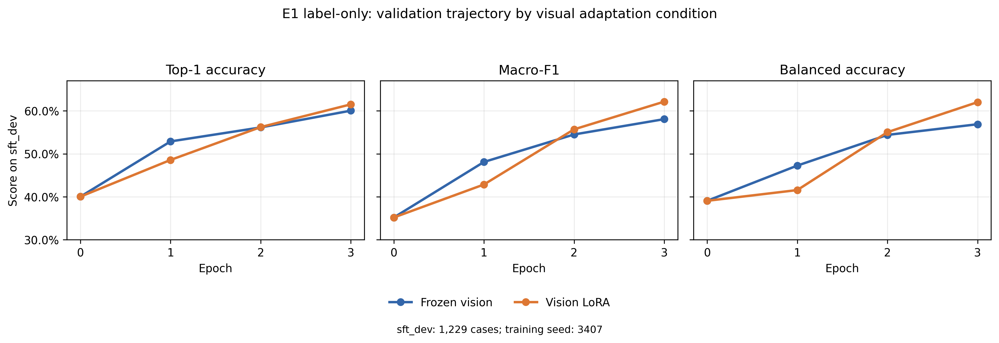
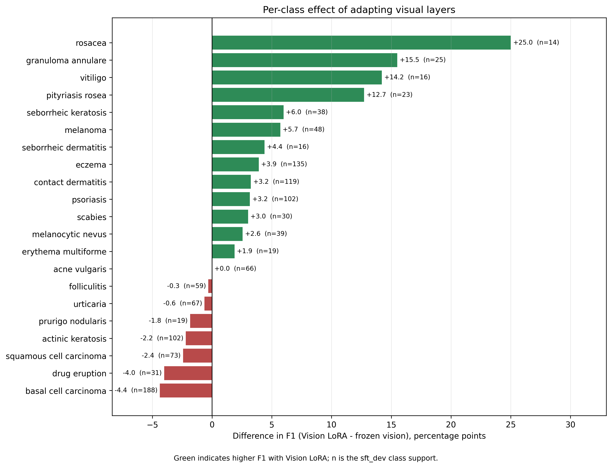
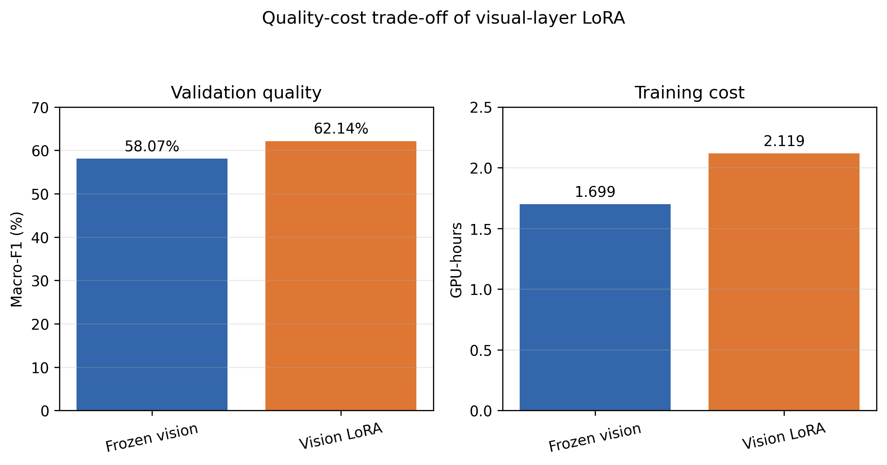

# E1 label-only: frozen vision versus Vision LoRA

Date of completion: 13 August 2026  
Experiment status: complete, exploratory single-seed comparison  
Verification status: **ANALYZED**; artefact integrity independently verified by
SHA-256, but the stochastic training result has not yet been replicated across
the two remaining confirmation seeds.

## Material Passport

- **Material type:** first training-experiment report and statistical validation.
- **Research object:** Qwen 3.5 4B adapted to 21-class dermatological image
  diagnosis with label-only supervision.
- **Primary evidence:** preserved local runs, per-case predictions, metrics,
  checkpoint manifests, resource telemetry, and the paired comparison output.
- **Data scope:** ISEPDermData 1.3.0; 7,541 images from four sources; no external
  evaluation is included in this report.
- **Evaluation scope:** 1,229 `sft_dev` cases in 851 leakage groups.
- **Inference scope:** deterministic, thinking disabled, exactly one canonical
  diagnosis label per image.
- **Statistical scope:** paired case comparison, group bootstrap with 10,000
  resamples, and exact McNemar test for Top-1 accuracy.
- **Human-read scope:** this report is derived from machine-readable experimental
  artefacts; no claim of manual review of every prediction is made.
- **Reproducibility note:** configurations, package versions, prompts, hashes,
  checkpoints, raw predictions, and source data for figures are preserved.

## 1. Objective

The first training phase, `E1_label`, asked whether a small multimodal model can
learn the project taxonomy from image-label pairs before introducing structured
explanations or teacher distillation. A controlled secondary question tested
whether applying LoRA to the visual layers improves performance relative to
keeping the visual component frozen.

The two conditions were:

1. `E1_frozen_vision`: LoRA in the language-side linear modules, with visual
   layers frozen.
2. `E1_unsloth_all`: the same recipe with LoRA also applied to visual layers.

The intended causal contrast was therefore the presence or absence of
visual-layer LoRA. Dataset, split, prompt, seed, image preprocessing, training
budget, LoRA rank, optimizer, scheduler, and decoding were held constant.

## 2. Experimental protocol

### 2.1 Data

- Dataset: `ISEPDermData` 1.3.0.
- Hugging Face revision:
  `f7403f817376de0dea0048bd3c490e294a0ccaca`.
- Total: 7,541 images, 5,671 leakage groups, 21 classes, and four sources.
- `sft_train`: 6,312 images in 4,820 groups.
- `sft_dev`: 1,229 images in 851 groups.
- Quick development panel: 210 images in 210 groups.
- Split: group-safe 85/15; zero shared leakage groups.
- Split SHA-256:
  `3a2b9970937b29c2bf5de339dc8a4f85c917a457eb4e1182426e1c71e43befcd`.

The model received only the image, the closed list of 21 permitted diagnoses,
and the request for one diagnosis. It did not receive clinical metadata,
teacher output, morphology, differential diagnosis, or rationale.

### 2.2 Model and optimization

- Base model:
  `Qwen/Qwen3.5-4B@851bf6e806efd8d0a36b00ddf55e13ccb7b8cd0a`.
- Framework: Unsloth 2026.7.3, Transformers 5.5.0, TRL 0.24.0, and
  PyTorch 2.10.0.
- Hardware: one NVIDIA L40S with 48 GB VRAM.
- Fine-tuning: BF16 LoRA, without 4-bit QLoRA.
- LoRA: rank 16, alpha 16, dropout 0, bias none, and `all-linear` targets.
- Seed: 3407.
- Microbatch: 2; gradient accumulation: 4; effective batch: 8.
- Optimizer: AdamW 8-bit; peak learning rate `2e-4`; weight decay `0.001`.
- Schedule: 5% warmup followed by linear decay.
- Budget: three epochs and 2,367 optimizer steps.
- Training loss: only assistant-response tokens contributed to the objective.
- Checkpoints: one at the end of each epoch.
- Checkpoint selection: highest macro-F1 on `sft_dev`.

The visual condition increased the trainable parameter count from 32,464,896 to
38,756,352 parameters. No full unfreezing of the vision encoder was performed;
`Vision LoRA` means low-rank adaptation of its selected linear modules.

## 3. Main results

### 3.1 Results by checkpoint

| Condition | Epoch | Top-1 | Macro-F1 | Balanced accuracy | Eval loss |
|---|---:|---:|---:|---:|---:|
| Base, no fine-tuning | 0 | 40.03% | 35.18% | 39.06% | — |
| Frozen vision | 1 | 52.89% | 48.11% | 47.26% | 0.2701 |
| Frozen vision | 2 | 56.14% | 54.50% | 54.40% | **0.2270** |
| Frozen vision | 3 | **60.05%** | **58.07%** | **56.88%** | 0.2619 |
| Vision LoRA | 1 | 48.58% | 42.86% | 41.56% | 0.2589 |
| Vision LoRA | 2 | 56.22% | 55.70% | 55.04% | 0.2413 |
| Vision LoRA | 3 | **61.51%** | **62.14%** | **62.03%** | **0.2157** |

All 1,229 outputs were valid in every full `sft_dev` evaluation.

Relative to the unadapted base model, the best Vision-LoRA checkpoint gained
21.48 percentage points in Top-1 accuracy, 26.96 points in macro-F1, and
22.96 points in balanced accuracy. This is evidence that even the simple
label-only phase produces a large in-domain specialization gain. It is not yet
evidence of external generalization.

**Figure 1.** Validation trajectory of the two conditions. The common point at
epoch zero is the same unadapted base checkpoint. The vector version is
[`checkpoint_trajectories.svg`](figures/01_e1_label_only_vision_ablation/checkpoint_trajectories.svg)
and the exact plotted values are in
[`checkpoint_trajectories_source.csv`](figures/01_e1_label_only_vision_ablation/checkpoint_trajectories_source.csv).

### 3.2 Paired comparison at the selected checkpoints

For Vision LoRA minus frozen vision:

- Top-1 accuracy: **+1.46 percentage points**.
- Macro-F1: **+4.07 percentage points**.
- Balanced accuracy: **+5.14 percentage points**.
- Group-bootstrap 95% CI for Top-1: **[-0.86, +3.86] points**.
- Group-bootstrap 95% CI for macro-F1: **[+1.13, +7.40] points**.
- Exact McNemar test for Top-1: `p=0.2269`.
- Correct only under Vision LoRA: 108 cases.
- Correct only under frozen vision: 90 cases.

The Top-1 result does not establish a statistically reliable difference: its
confidence interval includes zero and the McNemar result is not significant.
The macro-F1 interval excludes zero for the sampled leakage groups, supporting
a more balanced class-level benefit in this run. However, this bootstrap does
not quantify variability caused by training seed; only replication across seeds
can do that. Balanced accuracy currently has a point estimate but no paired
confidence interval in the archived comparison, so it must not be described as
statistically significant.

### 3.3 Class-level effects

Vision LoRA improved F1 for 13 classes, tied for one, and reduced it for seven.
The largest estimated gains occurred for rosacea (+25.0 points, `n=14`),
granuloma annulare (+15.5, `n=25`), vitiligo (+14.2, `n=16`), and pityriasis
rosea (+12.7, `n=23`). These are small class slices and therefore have high
sampling uncertainty. The gain for melanoma was +5.7 points (`n=48`).

The main regressions were basal cell carcinoma (-4.4 points, `n=188`), drug
eruption (-4.0, `n=31`), squamous cell carcinoma (-2.4, `n=73`), and actinic
keratosis (-2.2, `n=102`). The aggregate macro-F1 improvement must therefore
not be interpreted as universal improvement across diseases.

**Figure 2.** Difference in class F1 between Vision LoRA and frozen vision. The
figure includes each class's `sft_dev` support to make uncertainty in rare
classes visible. The vector version is
[`per_class_f1_difference.svg`](figures/01_e1_label_only_vision_ablation/per_class_f1_difference.svg)
and the source values are in
[`per_class_f1_difference_source.csv`](figures/01_e1_label_only_vision_ablation/per_class_f1_difference_source.csv).

The Vision-LoRA confusion matrix shows clinically plausible clusters that
remain unresolved:

- basal cell carcinoma was confused with actinic keratosis in 21 cases and
  squamous cell carcinoma in 13;
- squamous cell carcinoma was predicted as basal cell carcinoma in 23 cases;
- actinic keratosis was predicted as basal cell carcinoma in 25 cases;
- contact dermatitis was predicted as eczema in 29 cases;
- urticaria was predicted as eczema in 17 cases and contact dermatitis in 10;
- drug eruption was predicted as eczema in 6 cases and contact dermatitis in 6.

These errors suggest that later supervision should explicitly address
clinically confusable disease families. They do not, on their own, establish
that generic image augmentation is the missing intervention.

## 4. Quality versus computational cost

| Metric | Frozen vision | Vision LoRA | Change |
|---|---:|---:|---:|
| Training duration | 6,116 s | 7,629 s | +24.73% |
| GPU-hours | 1.699 | 2.119 | +24.73% |
| Peak VRAM | 14.88 GiB | 15.68 GiB | +0.80 GiB / +5.38% |
| Throughput | 3.096 samples/s | 2.482 samples/s | -19.83% |
| Trainable parameters | 32,464,896 | 38,756,352 | +19.38% |

Vision LoRA delivered the better macro-F1 at the cost of approximately 25%
more training time and GPU-hours. The extra peak memory was only 0.80 GiB on
the L40S, so the principal cost was computation rather than feasibility.

**Figure 3.** Macro-F1 and GPU-hours shown on separate zero-based axes to avoid
exaggerating the quality difference. The vector version is
[`quality_cost_tradeoff.svg`](figures/01_e1_label_only_vision_ablation/quality_cost_tradeoff.svg)
and the source values are in
[`quality_cost_tradeoff_source.csv`](figures/01_e1_label_only_vision_ablation/quality_cost_tradeoff_source.csv).

## 5. Figure and artefact catalogue for the dissertation

The three curated figures above are the recommended initial set for the thesis:

| Figure | Suggested use | Current location |
|---|---|---|
| Checkpoint trajectories | Results chapter; learning dynamics and comparison | `annotations/training_steps/figures/01_e1_label_only_vision_ablation/checkpoint_trajectories.{png,svg}` |
| Per-class F1 difference | Results/discussion; heterogeneous visual benefit | `annotations/training_steps/figures/01_e1_label_only_vision_ablation/per_class_f1_difference.{png,svg}` |
| Quality-cost trade-off | Efficiency subsection; quality versus compute | `annotations/training_steps/figures/01_e1_label_only_vision_ablation/quality_cost_tradeoff.{png,svg}` |

Prefer SVG when importing into the dissertation and retain the adjacent CSV as
the provenance of the plotted values. PNG is available for environments where
SVG import is unreliable.

Additional automatically generated figures are already preserved and may be
used selectively:

| Evidence | Frozen-vision path | Vision-LoRA path |
|---|---|---|
| Optimization loss curves | `outputs/training/e1_label_frozen_vision/full-l40s-frozen-seed3407-20260812/figures/loss_curves.{png,svg}` | `outputs/training/e1_label_unsloth_all/full-l40s-vision-seed3407-20260813/figures/loss_curves.{png,svg}` |
| Checkpoint eval loss | `.../e1_label_frozen_vision/.../figures/checkpoint_eval_loss.{png,svg}` | `.../e1_label_unsloth_all/.../figures/checkpoint_eval_loss.{png,svg}` |
| Per-class precision/recall/F1 | `.../e1_label_frozen_vision/.../figures/per_class_metrics.{png,svg}` | `.../e1_label_unsloth_all/.../figures/per_class_metrics.{png,svg}` |
| Confusion matrix | `.../e1_label_frozen_vision/.../figures/confusion_matrix.{png,svg}` | `.../e1_label_unsloth_all/.../figures/confusion_matrix.{png,svg}` |
| Class/source distributions | each run's `figures/class_distribution.*` and `figures/source_distribution.*` | same |
| VRAM, throughput, power, temperature | each run's `figures/resource_*.{png,svg}` | same |
| Trainable parameters | each run's `figures/trainable_parameters.{png,svg}` | same |

Every automatically generated chart has a corresponding `*_source.csv` in the
same `figures/` directory. Tables ready for the dissertation are available as
CSV and LaTeX in each run's `tables/` directory.

## 6. Statistical fallacy scan

All 11 checks in the experiment-validation protocol were considered:

| Check | Assessment |
|---|---|
| Simpson's paradox | Not excluded. Aggregate gains should later be stratified by source and, where available, skin tone. |
| Ecological fallacy | No group-level result is used to infer individual patient outcomes; claims remain at case/class level. |
| Berkson/selection bias | Caution: this is a curated four-source corpus, not a prospective clinical population. |
| Collider bias | No covariate-adjusted causal model was fitted; not applicable to the primary contrast. |
| Base-rate neglect | Macro-F1 and balanced accuracy accompany raw accuracy; clinical PPV/NPV claims are not made. |
| Regression to the mean | No arm or class was selected for training because of an extreme baseline result. |
| Survivorship bias | No evaluation attrition: all 1,229 assigned cases remained in the denominator. |
| Look-elsewhere effect | Per-class findings are exploratory and uncorrected; no class-level significance claim is made. |
| Garden of forking paths | The primary selection metric and two arms were specified before the runs, but the single-seed result remains exploratory. |
| Correlation versus causation | The controlled configuration contrast supports a within-protocol effect estimate; it does not support a general clinical causal claim. |
| Reverse causality | Not applicable to this intervention-and-evaluation design. |

Coverage: **11/11 checked**. Overall statistical confidence is **CAUTION**:
the paired case analysis is strong, but training-seed uncertainty and external
generalization remain unresolved.

## 7. Preservation and checkpoint provenance

- Best frozen checkpoint: epoch 3, `checkpoint-2367`; private Hub commit
  `f8a7ea4efe9be384628433dc1e1cf71ade75d7b2`.
- Best Vision-LoRA checkpoint: epoch 3, `checkpoint-2367`; private Hub commit
  `0896129d020eea6a662eaa08349579860a03a783`.
- Repository: private `danielfdias98/ISEP-training-checkpoints`.
- Three epoch checkpoints for each full condition are present on the Hub.
- Local frozen run: 162 files and 6,625,883,106 bytes; exact SHA match.
- Local Vision-LoRA run: 162 files and 6,766,730,216 bytes; exact SHA match.
- Local Vision-LoRA smoke run: 181 files and 7,014,678,643 bytes; exact SHA match.

The complete machine-generated campaign report is preserved at
`outputs/training/reports/e1_seed3407_campaign_final/final_training_report.md`,
with an HTML counterpart in the same directory. No clinical image or private
token was published with the checkpoints.

## 8. Decision about additional epochs, augmentation, and benchmarks

### 8.1 Should the current model receive two more epochs?

**Yes, but only as a separate, pre-declared continuation experiment after the
core three-seed confirmation.** The Vision-LoRA trajectory does not show a
plateau: from epoch 2 to epoch 3, macro-F1 rose from 55.70% to 62.14%, balanced
accuracy from 55.04% to 62.03%, and eval loss fell from 0.2413 to 0.2157. This
makes a short continuation scientifically plausible.

It must not be implemented as a naive resume of the old scheduler. The learning
rate had decayed to approximately `7.1e-7` near the final logged step and then
to zero at the planned end. Resuming the optimizer and scheduler unchanged
would provide almost no useful learning. A continuation should therefore:

- load the epoch-3 Vision-LoRA adapter as its starting model;
- initialize a new optimizer and a new, explicitly lower learning-rate schedule;
- use a fixed two-epoch budget and evaluate only at the two pre-declared ends;
- retain the original unaugmented `sft_dev`;
- be named and reported as `E1_continued`, not as part of the original run.

A practical initial range is a peak learning rate of `2e-5` to `5e-5`, but the
chosen value must be frozen before the continuation. This is an exploratory
ablation, not a replacement for seed replication.

### 8.2 Should image augmentation be added now?

**Not in the same first continuation run.** The current evidence shows continued
learning, not an established overfitting or domain-shift problem. Adding
augmentation and extra epochs simultaneously would make any change impossible
to attribute.

If augmentation is tested, the compact controlled design is:

1. `C0`: epoch-3 Vision-LoRA checkpoint plus two unaugmented epochs;
2. `C1`: the same checkpoint plus two epochs with a frozen, conservative
   augmentation policy;
3. same learning-rate schedule, examples seen, optimizer steps, seed, and
   unaugmented `sft_dev` in both arms.

The initial policy should avoid changing diagnostic colour and lesion content.
Reasonable candidates are mild rotation, translation/scale, and horizontal
reflection after clinical review. Strong colour jitter, random crops that may
remove the lesion, MixUp, CutMix, heavy blur, and compression should not enter
the primary augmentation arm. Photometric robustness can be evaluated later as
a separate intervention.

### 8.3 Should the fine-tuned model be uploaded and run on visual benchmarks?

**Yes, after locking the E1 recipe; benchmark results must not be used to tune
epochs or augmentation.** The adapter checkpoints are already in the private Hub
repository. A separate private, deployment-ready model should be created by
merging the selected adapter with the exact pinned base checkpoint, or by using
a benchmark backend with verified LoRA support. The merged model manifest must
record both source commits.

Before the Internal Benchmark is opened for the fine-tuned model, the following
should be frozen:

- the decision rule for the E1 recipe;
- seed policy;
- selected checkpoint rule;
- prompt, processor, resolution, decoding, and parser;
- the statement that benchmark results are evaluation-only.

The first benchmark pass should prioritize deterministic visual tasks without
LLM-as-a-judge: Visual Top-K, visual disease confusion sets, morphology MCQs,
diagnosis MCQs, visual grounding/no-image controls, and the deterministic
hallucination/counterfactual measures. Judge-based open-ended tasks can be a
separate second stage.

## 9. Recommended next sequence

The recommended order is:

1. **Confirm the original three-epoch ablation** by running both frozen vision
   and Vision LoRA with seeds 42 and 2026, unchanged.
2. **Aggregate the three seeds** and determine whether the class-balanced Vision
   LoRA gain persists. Do not choose a model simply because it is the best of
   three random seeds.
3. **Run the two-arm continuation pilot** (`C0` without augmentation and `C1`
   with a conservative augmentation policy) only if the extra-compute question
   remains important. This separates duration from augmentation.
4. **Lock the final E1 recipe and checkpoint rule.** Create a private merged
   deployment checkpoint with complete provenance.
5. **Run the held visual Internal Benchmark once for this locked E1 stage.** Use
   it to report generalization, not to choose hyperparameters.
6. Proceed to `E2_structured` and later distillation phases. Preserve E1 as the
   required label-only baseline.

If compute is limited and only one next action is possible, repeating seeds 42
and 2026 is more valuable scientifically than adding epochs or augmentation:
the present single-seed result cannot distinguish a stable Vision-LoRA benefit
from training stochasticity.

## 10. Thesis-ready conclusion

> In the first label-only specialization phase, both LoRA configurations
> substantially improved the Qwen 3.5 4B baseline on the leakage-safe
> development split. Applying LoRA to selected visual layers produced the best
> single-seed result, with 61.51% Top-1 accuracy, 62.14% macro-F1, and 62.03%
> balanced accuracy. Relative to freezing the visual component, the estimated
> gain was 1.46 percentage points in Top-1 and 4.07 points in macro-F1, at a
> cost of approximately 25% more GPU-hours. The paired confidence interval for
> macro-F1 excluded zero, whereas the Top-1 interval included zero and the
> McNemar test was not significant. Consequently, Vision LoRA was selected as
> the provisional E1 configuration, pending multi-seed confirmation and held-out
> benchmark evaluation.

## 11. Limitations and next evidence gate

- Only one training seed has completed for each condition.
- The group bootstrap captures case-sampling uncertainty but not training-seed
  variability.
- The largest class gains involve small supports and are exploratory.
- Aggregate source and skin-tone stratification has not yet been produced for
  these fine-tuned checkpoints.
- `sft_dev` is an in-domain development split and cannot establish external
  clinical generalization.
- The remote environment manifest recorded a null Git commit; code state should
  be pinned explicitly in future runs.
- The last Vision-LoRA checkpoint was still improving, so the optimal duration
  remains unknown.
- Internal visual and external DDI/SkinDisNet evaluations remain pending.

The mandatory next evidence gate for a confirmatory claim is the unchanged
three-seed replication followed by evaluation of the locked E1 recipe on the
held visual benchmark.
